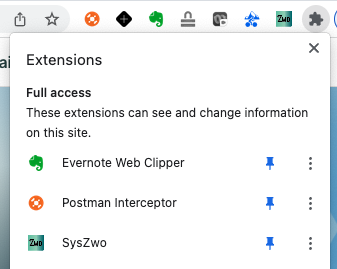
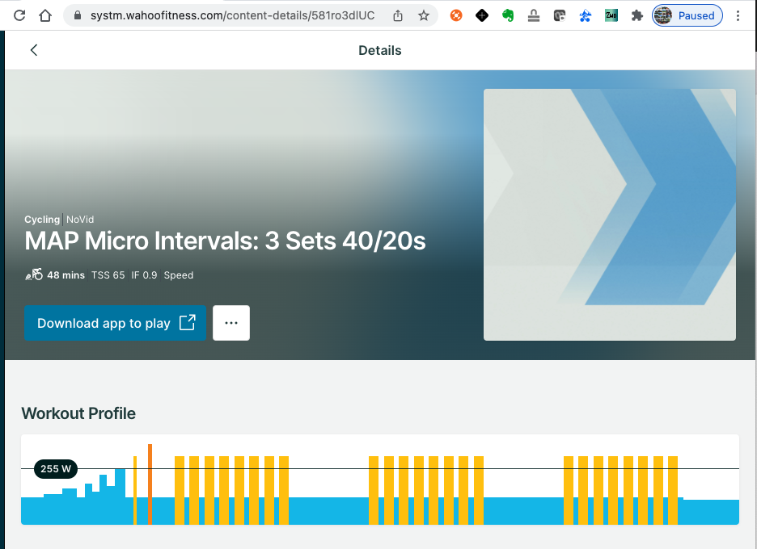

# SysZwo
A simple Chrome extension which converts Systm worksouts to Zwift files (.zwo). I created the extension because I wanted to follow a Systm training plan but complete the workouts in Zwift.

# Overview
The extension requires the user log onto their Systm account in the browser, then open the workout they want to export to Zwift. When on the workout detail page, the power graph needs to be shown, this is used as reference to create the .zwo file.

Press the extension button and the file will be downloaded with the filename of the workout.

# Installation
Download or clone this repo (and unzip if needed).

Open Chrome -> Manage Extensions

Select "Developer Mode" on the top right which allows you to install extensions locally.

Select "Load unpacked" and point to the unzipped folder.

You should now see SysZwo as an extension. Pin the extension to the toolbar by pressing the small pin button. Open Systm to the workout detail page and press the icon in the extensions list to download the data.

# Uploading to Zwift

Instructions for uploading .zwo files can be found on the Zwift website here:
https://www.zwift.com/news/11792-importing-and-sharing-custom-zwift-workouts

# Requirements

A Systm account

# Limitations

The extenstion does not export cadence targets from Systm, this is because the power profile on the workout detail page does not include them.

# Notes

- This extension is not supported or affilated with Systm or Zwift.
- Systm is a registered trademark of Wahoo Fitness, L.L.C.
- Zwift is a registered trademark of Zwift, Inc.

# Process Overview

